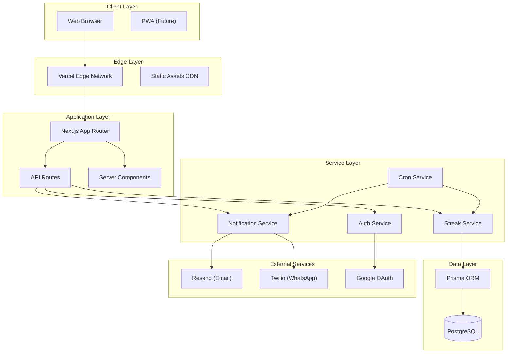
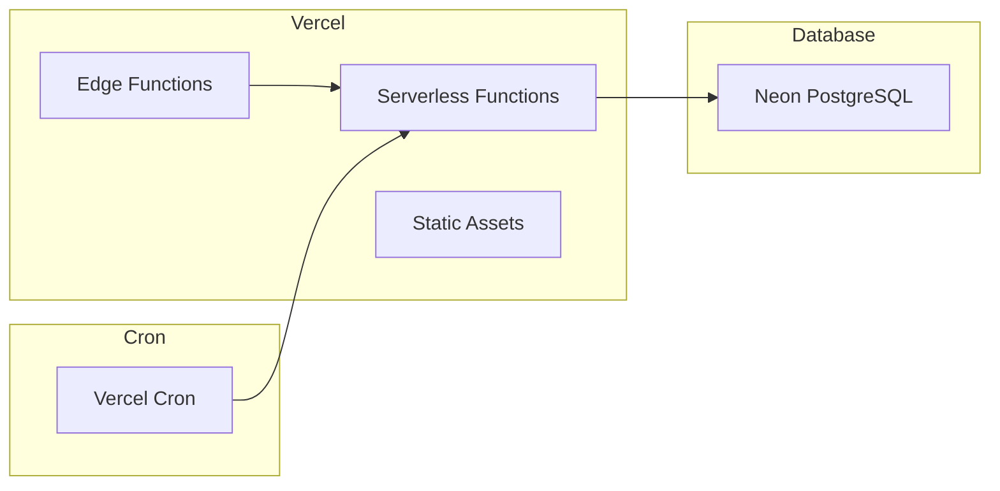
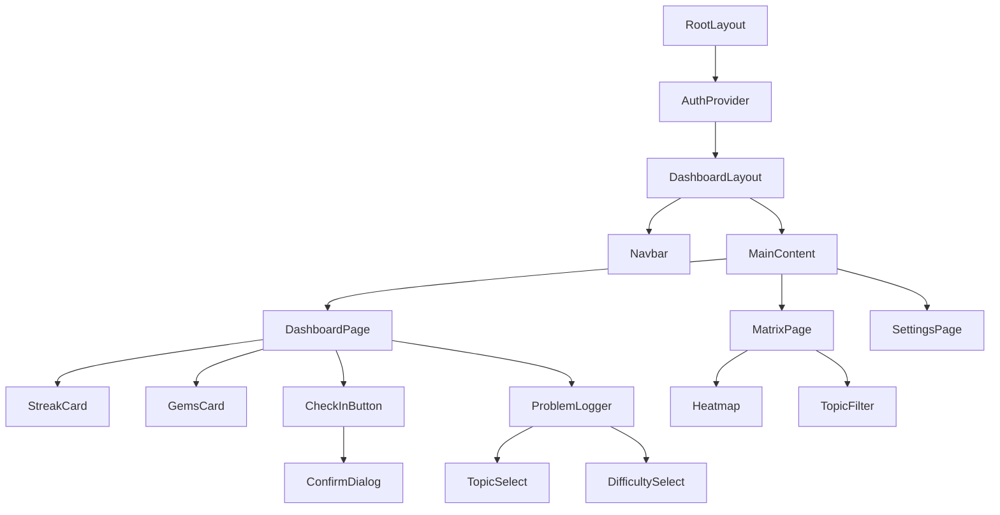
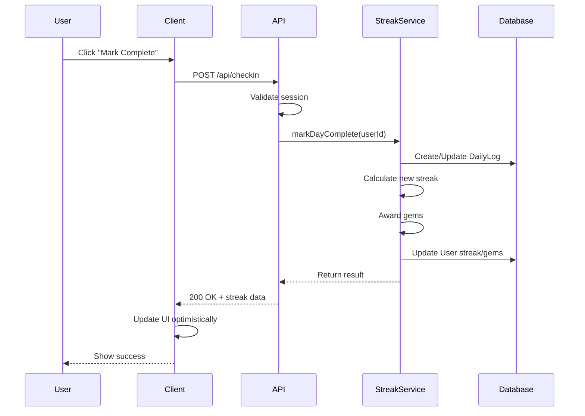
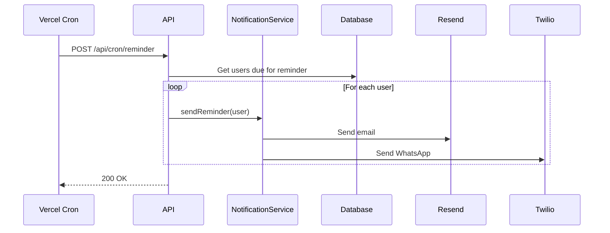

# High-Level Design: StreakDSA

**Version:** 1.0  
**Last Updated:** 2026-01-01  
**Status:** Draft

---

## 1. Executive Summary

StreakDSA is a streak-based accountability system for daily DSA practice. This document outlines the high-level architecture, technology decisions, and system design.

---

## 2. System Architecture

### 2.1 Architecture Overview



### 2.2 Deployment Architecture



---

## 3. Technology Stack

### 3.1 Core Technologies

| Layer          | Technology   | Version | Rationale                   |
| -------------- | ------------ | ------- | --------------------------- |
| **Runtime**    | Node.js      | 20 LTS  | Stability, performance      |
| **Framework**  | Next.js      | 15.x    | App Router, RSC, API routes |
| **Language**   | TypeScript   | 5.x     | Type safety, DX             |
| **Database**   | PostgreSQL   | 16      | ACID, reliability           |
| **ORM**        | Prisma       | 6.x     | Type-safe, migrations       |
| **Styling**    | Tailwind CSS | 4.x     | Utility-first, fast         |
| **Components** | shadcn/ui    | Latest  | Accessible, customizable    |

### 3.2 External Services

| Service      | Provider    | Purpose               |
| ------------ | ----------- | --------------------- |
| **Hosting**  | Vercel      | Serverless deployment |
| **Database** | Neon        | Serverless PostgreSQL |
| **Auth**     | NextAuth.js | OAuth + Magic Link    |
| **Email**    | Resend      | Transactional email   |
| **WhatsApp** | Twilio      | Message delivery      |
| **Cron**     | Vercel Cron | Scheduled jobs        |

### 3.3 ADR: Technology Decisions

#### ADR-001: Next.js App Router

**Decision:** Use Next.js 15 with App Router  
**Context:** Need SSR, API routes, and fast DX  
**Consequences:** Modern patterns, learning curve for traditional React devs

#### ADR-002: Serverless PostgreSQL

**Decision:** Use Neon for database  
**Context:** Need PostgreSQL with serverless scaling  
**Consequences:** Cold starts possible, connection pooling required

#### ADR-003: Prisma ORM

**Decision:** Use Prisma for database access  
**Context:** Type safety between schema and code  
**Consequences:** Some N+1 risks, need careful query design

---

## 4. Component Architecture

### 4.1 Application Structure

```
streak-dsa/
├── app/                      # Next.js App Router
│   ├── (auth)/               # Auth routes group
│   │   ├── login/
│   │   └── onboard/
│   ├── (dashboard)/          # Protected routes
│   │   ├── page.tsx          # Dashboard
│   │   ├── matrix/           # Heatmap view
│   │   └── settings/
│   ├── api/                  # API routes
│   │   ├── auth/[...nextauth]/
│   │   ├── checkin/
│   │   ├── problems/
│   │   ├── dashboard/
│   │   ├── matrix/
│   │   └── cron/
│   ├── layout.tsx
│   └── globals.css
├── components/               # React components
│   ├── ui/                   # shadcn/ui components
│   ├── dashboard/
│   ├── heatmap/
│   └── forms/
├── lib/                      # Utilities
│   ├── db.ts                 # Prisma client
│   ├── auth.ts               # NextAuth config
│   ├── streak.ts             # Streak logic
│   ├── gems.ts               # Gems logic
│   └── notifications.ts      # Email/WhatsApp
├── prisma/
│   └── schema.prisma
├── public/
└── types/                    # TypeScript types
```

### 4.2 Component Hierarchy



---

## 5. Data Flow

### 5.1 Check-In Flow



### 5.2 Notification Flow



---

## 6. Security Design

### 6.1 Authentication

- **Method:** NextAuth.js with JWT strategy
- **Providers:** Google OAuth, Magic Link (email)
- **Session:** HTTP-only secure cookies
- **Token Refresh:** Automatic via NextAuth

### 6.2 Authorization

| Resource       | Rule                        |
| -------------- | --------------------------- |
| Dashboard      | Authenticated users only    |
| Check-in       | Own user only               |
| Problems       | Own user only               |
| Cron endpoints | CRON_SECRET header required |

### 6.3 Data Protection

- **Transit:** TLS 1.3 (enforced by Vercel)
- **At Rest:** AES-256 (Neon default)
- **Secrets:** Environment variables via Vercel

---

## 7. Scalability Considerations

### 7.1 Current Design (MVP)

- Single region deployment
- Serverless auto-scaling
- Connection pooling via Prisma

### 7.2 Future Scaling

| Concern                 | Solution                       |
| ----------------------- | ------------------------------ |
| Database connections    | Prisma Accelerate or PgBouncer |
| Notification throughput | Queue (Inngest/Trigger.dev)    |
| Global latency          | Edge deployment                |
| Read scaling            | Read replicas                  |

---

## 8. Monitoring & Observability

### 8.1 MVP Monitoring

| Aspect      | Tool                  |
| ----------- | --------------------- |
| Errors      | Vercel Error Tracking |
| Logs        | Vercel Logs           |
| Performance | Vercel Analytics      |
| Uptime      | Vercel Status         |

### 8.2 Future (v2.0)

- Sentry for error tracking
- Axiom for logging
- Custom success metrics dashboard

---

## 9. Key Design Decisions

### 9.1 Streak Calculation

**Approach:** Eager calculation on check-in + daily batch reconciliation

```
On Check-In:
1. Mark DailyLog as complete
2. Increment current_streak
3. Update max_streak if needed
4. Award daily gems

On Cron (midnight):
1. Find users who missed yesterday
2. Set current_streak = 0
3. Send missed day alerts
```

### 9.2 Timezone Handling

- Store user timezone in profile
- Reminders scheduled per user timezone
- Deadline calculation in user's local time
- All dates stored as UTC in database

### 9.3 Gems Economy

**Simple additive model:**

- No spending, display only
- Milestone bonuses for 7/30 day streaks
- Pledge completion bonus
- No inflation concerns (isolated to user)

---

## 10. Integration Points

### 10.1 External APIs

| Service      | Integration Type | Rate Limits     |
| ------------ | ---------------- | --------------- |
| Resend       | REST API         | 100/day free    |
| Twilio       | REST API         | Pay per message |
| Google OAuth | OAuth 2.0        | Standard        |

### 10.2 Future Integrations (v2.0)

| Integration | Approach           |
| ----------- | ------------------ |
| LeetCode    | Browser extension  |
| Striver A2Z | Sheet URL scraping |
| Codeforces  | Public API         |

---

## 11. Risk Assessment

| Risk                 | Impact | Mitigation                               |
| -------------------- | ------ | ---------------------------------------- |
| Database downtime    | High   | Neon auto-failover, read replicas        |
| Notification failure | Medium | Retry queue, fallback to email           |
| Auth provider outage | Medium | Multiple providers (Google + Magic Link) |
| Rate limiting        | Low    | Batch notifications, caching             |

---

## Document History

| Version | Date       | Author | Changes     |
| ------- | ---------- | ------ | ----------- |
| 1.0     | 2026-01-01 | —      | Initial HLD |

---

**End of Document**
