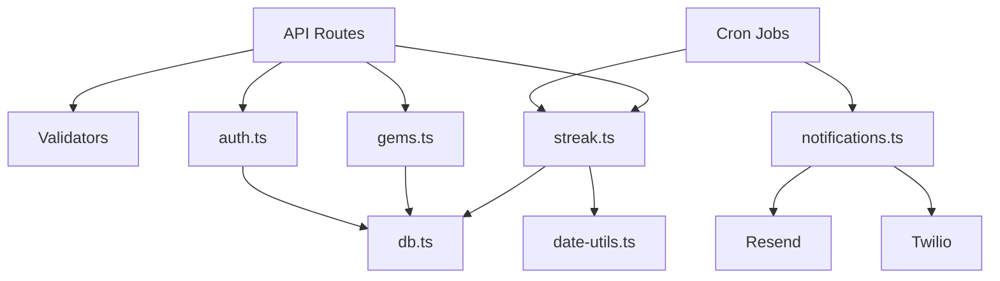

# Low-Level Design: StreakDSA

**Version:** 1.0  
**Last Updated:** 2026-01-01  
**Status:** Draft

---

## Table of Contents

1. [Module Breakdown](#1-module-breakdown)
2. [Database Schema Details](#2-database-schema-details)
3. [API Implementation Details](#3-api-implementation-details)
4. [Business Logic Specifications](#4-business-logic-specifications)
5. [Component Specifications](#5-component-specifications)
6. [State Management](#6-state-management)
7. [Error Handling](#7-error-handling)
8. [Testing Strategy](#8-testing-strategy)

---

## 1. Module Breakdown

### 1.1 Core Modules

```
lib/
├── db.ts              # Prisma client singleton
├── auth.ts            # NextAuth configuration
├── streak.ts          # Streak calculation logic
├── gems.ts            # Gems awarding logic
├── notifications.ts   # Email/WhatsApp service
├── date-utils.ts      # Timezone & date helpers
└── validators.ts      # Zod schemas for validation
```

### 1.2 Module Dependencies



---

## 2. Database Schema Details

### 2.1 Indexes & Performance

```prisma
model User {
  // ... fields
  @@index([email])          // Login lookup
  @@index([reminderTime])   // Cron batch queries
}

model DailyLog {
  // ... fields
  @@unique([userId, date])  // One log per user per day
  @@index([userId])         // User's history
  @@index([date])           // Daily batch processing
  @@index([userId, date, completed])  // Dashboard queries
}

model ProblemLog {
  @@index([dailyLogId])     // Problems per day
}
```

### 2.2 Query Patterns

| Query     | Pattern                                           | Index Used         |
| --------- | ------------------------------------------------- | ------------------ |
| Login     | `findUnique({ email })`                           | email unique       |
| Dashboard | `findFirst({ userId, date })`                     | userId, date       |
| Heatmap   | `findMany({ userId, date range })`                | userId, date       |
| Cron      | `findMany({ reminderTime, NOT completed today })` | reminderTime, date |

---

## 3. API Implementation Details

### 3.1 POST /api/checkin

```typescript
// app/api/checkin/route.ts
import { NextRequest, NextResponse } from "next/server";
import { getServerSession } from "next-auth";
import { authOptions } from "@/lib/auth";
import { markDayComplete } from "@/lib/streak";

export async function POST(req: NextRequest) {
  // 1. Authenticate
  const session = await getServerSession(authOptions);
  if (!session?.user?.id) {
    return NextResponse.json(
      { success: false, error: { code: "UNAUTHORIZED" } },
      { status: 401 }
    );
  }

  // 2. Check deadline
  const user = await db.user.findUnique({ where: { id: session.user.id } });
  if (isDeadlinePassed(user.timezone, user.reminderTime)) {
    return NextResponse.json(
      { success: false, error: { code: "DEADLINE_PASSED" } },
      { status: 403 }
    );
  }

  // 3. Mark complete
  try {
    const result = await markDayComplete(session.user.id);
    return NextResponse.json({ success: true, data: result });
  } catch (error) {
    if (error.code === "ALREADY_CHECKED_IN") {
      return NextResponse.json(
        { success: false, error: { code: "ALREADY_CHECKED_IN" } },
        { status: 409 }
      );
    }
    throw error;
  }
}
```

### 3.2 POST /api/problems

```typescript
// app/api/problems/route.ts
import { z } from "zod";

const ProblemSchema = z.object({
  topic: z.enum(["ARRAYS", "DYNAMIC_PROGRAMMING" /* ... */]),
  name: z.string().min(1).max(255),
  difficulty: z.enum(["EASY", "MEDIUM", "HARD"]),
  externalUrl: z.string().url().optional(),
});

export async function POST(req: NextRequest) {
  const session = await getServerSession(authOptions);
  if (!session?.user?.id) {
    return unauthorized();
  }

  // Parse and validate
  const body = await req.json();
  const parsed = ProblemSchema.safeParse(body);
  if (!parsed.success) {
    return validationError(parsed.error);
  }

  // Get or create today's log
  const today = getTodayForUser(user.timezone);
  const dailyLog = await getOrCreateDailyLog(session.user.id, today);

  // Check limit
  const problemCount = await db.problemLog.count({
    where: { dailyLogId: dailyLog.id },
  });
  if (problemCount >= 2) {
    return NextResponse.json(
      { success: false, error: { code: "PROBLEM_LIMIT_EXCEEDED" } },
      { status: 400 }
    );
  }

  // Create problem
  const problem = await db.problemLog.create({
    data: {
      dailyLogId: dailyLog.id,
      ...parsed.data,
    },
  });

  return NextResponse.json({ success: true, data: problem }, { status: 201 });
}
```

### 3.3 GET /api/dashboard

```typescript
// app/api/dashboard/route.ts
export async function GET(req: NextRequest) {
  const session = await getServerSession(authOptions);
  if (!session?.user?.id) {
    return unauthorized();
  }

  const user = await db.user.findUnique({
    where: { id: session.user.id },
    select: {
      name: true,
      email: true,
      pledgeDays: true,
      startDate: true,
      currentStreak: true,
      maxStreak: true,
      daysCompleted: true,
      gems: true,
      timezone: true,
      reminderTime: true,
    },
  });

  const today = getTodayForUser(user.timezone);
  const todayLog = await db.dailyLog.findUnique({
    where: { userId_date: { userId: session.user.id, date: today } },
    include: { problems: true },
  });

  const endDate = addDays(user.startDate, user.pledgeDays);
  const daysRemaining = differenceInDays(endDate, today);

  return NextResponse.json({
    success: true,
    data: {
      user: { name: user.name, email: user.email },
      pledge: {
        totalDays: user.pledgeDays,
        daysCompleted: user.daysCompleted,
        daysRemaining: Math.max(0, daysRemaining),
        startDate: user.startDate,
        endDate,
      },
      streak: {
        current: user.currentStreak,
        max: user.maxStreak,
      },
      gems: user.gems,
      today: {
        completed: todayLog?.completed ?? false,
        deadlineAt: getDeadlineForUser(user.timezone, user.reminderTime),
        problemsLogged: todayLog?.problems.length ?? 0,
      },
    },
  });
}
```

---

## 4. Business Logic Specifications

### 4.1 Streak Service (lib/streak.ts)

```typescript
// lib/streak.ts
import { db } from "./db";
import { awardDailyGems, awardMilestoneGems } from "./gems";

interface CheckInResult {
  date: Date;
  completed: boolean;
  markedAt: Date;
  streak: {
    current: number;
    max: number;
    gemsAwarded: number;
    milestoneReached: string | null;
  };
}

export async function markDayComplete(userId: string): Promise<CheckInResult> {
  const user = await db.user.findUnique({ where: { id: userId } });
  const today = getTodayForUser(user.timezone);

  return await db.$transaction(async (tx) => {
    // 1. Check if already completed
    const existing = await tx.dailyLog.findUnique({
      where: { userId_date: { userId, date: today } },
    });

    if (existing?.completed) {
      throw new AlreadyCheckedInError();
    }

    // 2. Create or update daily log
    const dailyLog = await tx.dailyLog.upsert({
      where: { userId_date: { userId, date: today } },
      create: {
        userId,
        date: today,
        completed: true,
        markedAt: new Date(),
      },
      update: {
        completed: true,
        markedAt: new Date(),
      },
    });

    // 3. Calculate new streak
    const newStreak = user.currentStreak + 1;
    const newMaxStreak = Math.max(user.maxStreak, newStreak);

    // 4. Award gems
    let gemsAwarded = 10; // Daily completion
    let milestoneReached: string | null = null;

    if (newStreak === 7) {
      gemsAwarded += 50;
      milestoneReached = "7_DAY_STREAK";
    } else if (newStreak === 30) {
      gemsAwarded += 200;
      milestoneReached = "30_DAY_STREAK";
    }

    // Check pledge completion
    const newDaysCompleted = user.daysCompleted + 1;
    if (newDaysCompleted === user.pledgeDays) {
      gemsAwarded += 500;
      milestoneReached = "PLEDGE_COMPLETE";
    }

    // 5. Update user
    await tx.user.update({
      where: { id: userId },
      data: {
        currentStreak: newStreak,
        maxStreak: newMaxStreak,
        daysCompleted: newDaysCompleted,
        gems: { increment: gemsAwarded },
      },
    });

    return {
      date: today,
      completed: true,
      markedAt: dailyLog.markedAt!,
      streak: {
        current: newStreak,
        max: newMaxStreak,
        gemsAwarded,
        milestoneReached,
      },
    };
  });
}

export async function processYesterdaysMissedDays(): Promise<{
  processed: number;
  missedDays: number;
  streaksReset: number;
}> {
  const yesterday = subDays(new Date(), 1);

  // Find users who didn't complete yesterday
  const missedUsers = await db.user.findMany({
    where: {
      startDate: { lte: yesterday },
      dailyLogs: {
        none: {
          date: yesterday,
          completed: true,
        },
      },
    },
  });

  let streaksReset = 0;

  for (const user of missedUsers) {
    // Create missed day log
    await db.dailyLog.upsert({
      where: { userId_date: { userId: user.id, date: yesterday } },
      create: { userId: user.id, date: yesterday, completed: false },
      update: { completed: false },
    });

    // Reset streak if it was > 0
    if (user.currentStreak > 0) {
      await db.user.update({
        where: { id: user.id },
        data: { currentStreak: 0 },
      });
      streaksReset++;
    }
  }

  return {
    processed: missedUsers.length,
    missedDays: missedUsers.length,
    streaksReset,
  };
}
```

### 4.2 Gems Calculation

```typescript
// lib/gems.ts
export const GEMS_CONFIG = {
  DAILY_COMPLETION: 10,
  STREAK_7_DAYS: 50,
  STREAK_30_DAYS: 200,
  PLEDGE_COMPLETE: 500,
} as const;

export function calculateGemsForStreak(
  newStreak: number,
  isPledgeComplete: boolean
): { total: number; milestone: string | null } {
  let total = GEMS_CONFIG.DAILY_COMPLETION;
  let milestone: string | null = null;

  if (newStreak === 7) {
    total += GEMS_CONFIG.STREAK_7_DAYS;
    milestone = "7_DAY_STREAK";
  } else if (newStreak === 30) {
    total += GEMS_CONFIG.STREAK_30_DAYS;
    milestone = "30_DAY_STREAK";
  }

  if (isPledgeComplete) {
    total += GEMS_CONFIG.PLEDGE_COMPLETE;
    milestone = "PLEDGE_COMPLETE";
  }

  return { total, milestone };
}
```

### 4.3 Date Utilities

```typescript
// lib/date-utils.ts
import { formatInTimeZone, zonedTimeToUtc, utcToZonedTime } from "date-fns-tz";

export function getTodayForUser(timezone: string): Date {
  const now = new Date();
  const zonedNow = utcToZonedTime(now, timezone);
  // Return start of day in user's timezone, as UTC
  const startOfDay = new Date(
    zonedNow.getFullYear(),
    zonedNow.getMonth(),
    zonedNow.getDate()
  );
  return zonedTimeToUtc(startOfDay, timezone);
}

export function isDeadlinePassed(
  timezone: string,
  reminderTime: string // "22:00"
): boolean {
  const now = new Date();
  const zonedNow = utcToZonedTime(now, timezone);
  const [hours, minutes] = reminderTime.split(":").map(Number);

  return (
    zonedNow.getHours() > hours ||
    (zonedNow.getHours() === hours && zonedNow.getMinutes() >= minutes)
  );
}

export function getDeadlineForUser(
  timezone: string,
  reminderTime: string
): Date {
  const today = getTodayForUser(timezone);
  const [hours, minutes] = reminderTime.split(":").map(Number);
  const deadline = new Date(today);
  deadline.setHours(hours, minutes, 0, 0);
  return zonedTimeToUtc(deadline, timezone);
}
```

---

## 5. Component Specifications

### 5.1 Dashboard Page

```tsx
// app/(dashboard)/page.tsx
import { StreakCard } from "@/components/dashboard/streak-card";
import { GemsCard } from "@/components/dashboard/gems-card";
import { CheckInButton } from "@/components/dashboard/check-in-button";
import { ProblemLogger } from "@/components/dashboard/problem-logger";
import { getDashboardData } from "@/lib/api";

export default async function DashboardPage() {
  const data = await getDashboardData();

  return (
    <div className="container mx-auto p-4 space-y-6">
      <div className="grid grid-cols-1 md:grid-cols-3 gap-4">
        <StreakCard current={data.streak.current} max={data.streak.max} />
        <GemsCard gems={data.gems} />
        <PledgeCard
          daysCompleted={data.pledge.daysCompleted}
          totalDays={data.pledge.totalDays}
        />
      </div>

      <CheckInButton
        completed={data.today.completed}
        deadline={data.today.deadlineAt}
      />

      {data.today.completed && (
        <ProblemLogger
          problemsLogged={data.today.problemsLogged}
          maxProblems={2}
        />
      )}
    </div>
  );
}
```

### 5.2 Check-In Button Component

```tsx
// components/dashboard/check-in-button.tsx
"use client";

import { useState, useTransition } from "react";
import { Button } from "@/components/ui/button";
import { checkIn } from "@/app/actions";
import { toast } from "sonner";

interface Props {
  completed: boolean;
  deadline: string;
}

export function CheckInButton({ completed, deadline }: Props) {
  const [isPending, startTransition] = useTransition();
  const [isCompleted, setIsCompleted] = useState(completed);

  const handleCheckIn = () => {
    startTransition(async () => {
      try {
        const result = await checkIn();
        if (result.success) {
          setIsCompleted(true);
          toast.success(
            `Day complete! Streak: ${result.data.streak.current} 🔥`
          );
          if (result.data.streak.milestoneReached) {
            toast.success(
              `Milestone reached! +${result.data.streak.gemsAwarded} gems 💎`
            );
          }
        }
      } catch (error) {
        toast.error("Failed to check in. Please try again.");
      }
    });
  };

  if (isCompleted) {
    return (
      <div className="bg-green-100 dark:bg-green-900 rounded-lg p-8 text-center">
        <div className="text-4xl mb-2">✅</div>
        <p className="text-lg font-medium text-green-800 dark:text-green-200">
          Today Complete!
        </p>
      </div>
    );
  }

  return (
    <Button
      onClick={handleCheckIn}
      disabled={isPending}
      size="lg"
      className="w-full h-20 text-xl font-bold"
    >
      {isPending ? "Marking..." : "Mark Today Complete ✓"}
    </Button>
  );
}
```

### 5.3 Heatmap Component

```tsx
// components/heatmap/heatmap.tsx
"use client";

import { useMemo } from "react";
import { cn } from "@/lib/utils";

interface DayData {
  date: string;
  completed: boolean;
  isMilestone: boolean;
}

interface Props {
  days: DayData[];
  startDate: string;
}

export function Heatmap({ days, startDate }: Props) {
  const dayMap = useMemo(() => {
    return new Map(days.map((d) => [d.date, d]));
  }, [days]);

  // Generate grid of dates from startDate to today
  const grid = useMemo(() => {
    const result: (DayData | null)[][] = [];
    // ... generate weeks x 7 days grid
    return result;
  }, [startDate, dayMap]);

  return (
    <div className="overflow-x-auto">
      <div className="inline-grid grid-flow-col gap-1">
        {grid.map((week, weekIdx) => (
          <div key={weekIdx} className="grid grid-rows-7 gap-1">
            {week.map((day, dayIdx) => (
              <HeatmapCell key={`${weekIdx}-${dayIdx}`} day={day} />
            ))}
          </div>
        ))}
      </div>
      <HeatmapLegend />
    </div>
  );
}

function HeatmapCell({ day }: { day: DayData | null }) {
  if (!day) {
    return <div className="w-4 h-4 rounded-sm bg-muted" />;
  }

  return (
    <div
      className={cn(
        "w-4 h-4 rounded-sm",
        day.completed && !day.isMilestone && "bg-green-500",
        day.completed && day.isMilestone && "bg-orange-500",
        !day.completed && "bg-red-500"
      )}
      title={`${day.date}: ${day.completed ? "Completed" : "Missed"}`}
    />
  );
}
```

---

## 6. State Management

### 6.1 Server State

- **Primary:** React Server Components fetch data
- **Mutations:** Server Actions for check-in, problem logging
- **Revalidation:** `revalidatePath()` after mutations

### 6.2 Client State

- **Local:** `useState` for optimistic UI
- **Forms:** React Hook Form + Zod
- **Toasts:** Sonner for notifications

### 6.3 No Global State

MVP intentionally avoids complex state management:

- No Redux/Zustand
- No React Query (using RSC instead)
- Simple prop drilling for nested components

---

## 7. Error Handling

### 7.1 Error Hierarchy

```typescript
// lib/errors.ts
export class AppError extends Error {
  constructor(
    public code: string,
    message: string,
    public status: number = 400
  ) {
    super(message);
  }
}

export class AlreadyCheckedInError extends AppError {
  constructor() {
    super("ALREADY_CHECKED_IN", "Today has already been marked complete", 409);
  }
}

export class DeadlinePassedError extends AppError {
  constructor() {
    super("DEADLINE_PASSED", "Check-in deadline for today has passed", 403);
  }
}

export class ProblemLimitError extends AppError {
  constructor() {
    super("PROBLEM_LIMIT_EXCEEDED", "Maximum 2 problems per day allowed", 400);
  }
}
```

### 7.2 API Error Handler

```typescript
// lib/api-utils.ts
export function handleApiError(error: unknown): NextResponse {
  if (error instanceof AppError) {
    return NextResponse.json(
      { success: false, error: { code: error.code, message: error.message } },
      { status: error.status }
    );
  }

  console.error("Unhandled error:", error);
  return NextResponse.json(
    {
      success: false,
      error: { code: "INTERNAL_ERROR", message: "Something went wrong" },
    },
    { status: 500 }
  );
}
```

---

## 8. Testing Strategy

### 8.1 Unit Tests

```typescript
// __tests__/lib/streak.test.ts
import { describe, it, expect, beforeEach } from "vitest";
import { calculateGemsForStreak } from "@/lib/gems";

describe("calculateGemsForStreak", () => {
  it("awards 10 gems for daily completion", () => {
    const result = calculateGemsForStreak(1, false);
    expect(result.total).toBe(10);
    expect(result.milestone).toBeNull();
  });

  it("awards 60 gems for 7-day streak", () => {
    const result = calculateGemsForStreak(7, false);
    expect(result.total).toBe(60); // 10 + 50
    expect(result.milestone).toBe("7_DAY_STREAK");
  });

  it("awards 210 gems for 30-day streak", () => {
    const result = calculateGemsForStreak(30, false);
    expect(result.total).toBe(210); // 10 + 200
    expect(result.milestone).toBe("30_DAY_STREAK");
  });

  it("awards 510 gems for pledge completion", () => {
    const result = calculateGemsForStreak(90, true);
    expect(result.total).toBe(510); // 10 + 500
    expect(result.milestone).toBe("PLEDGE_COMPLETE");
  });
});
```

### 8.2 Integration Tests

```typescript
// __tests__/api/checkin.test.ts
import { describe, it, expect, beforeEach } from "vitest";
import { createMocks } from "node-mocks-http";
import { POST } from "@/app/api/checkin/route";

describe("POST /api/checkin", () => {
  beforeEach(async () => {
    await resetDatabase();
    await createTestUser();
  });

  it("marks today as complete", async () => {
    const { req } = createMocks({ method: "POST" });
    const response = await POST(req);
    const data = await response.json();

    expect(response.status).toBe(200);
    expect(data.success).toBe(true);
    expect(data.data.completed).toBe(true);
  });

  it("returns 409 if already checked in", async () => {
    await checkInTestUser();

    const { req } = createMocks({ method: "POST" });
    const response = await POST(req);

    expect(response.status).toBe(409);
  });
});
```

### 8.3 E2E Tests

```typescript
// e2e/checkin.spec.ts
import { test, expect } from "@playwright/test";

test("user can check in", async ({ page }) => {
  await page.goto("/");
  await page.click('[data-testid="check-in-button"]');

  await expect(page.locator('[data-testid="success-message"]')).toBeVisible();
  await expect(page.locator('[data-testid="streak-count"]')).toContainText("1");
});
```

---

## Document History

| Version | Date       | Author | Changes     |
| ------- | ---------- | ------ | ----------- |
| 1.0     | 2026-01-01 | —      | Initial LLD |

---

**End of Document**
