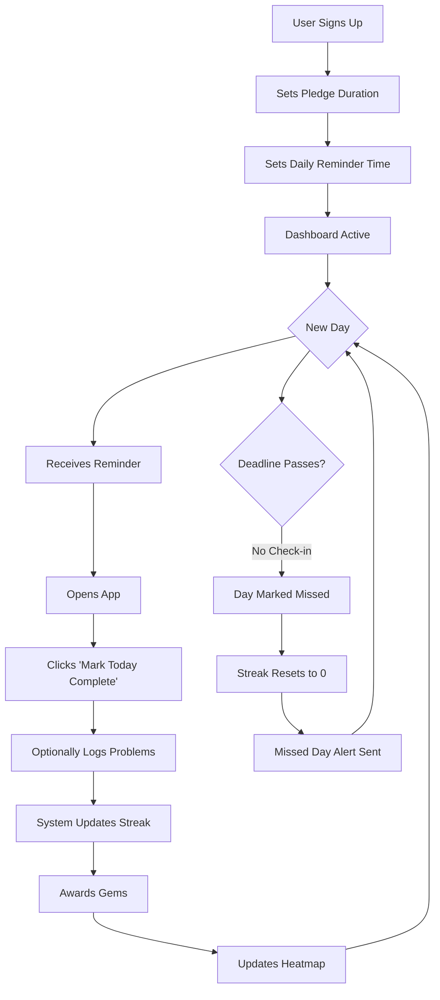
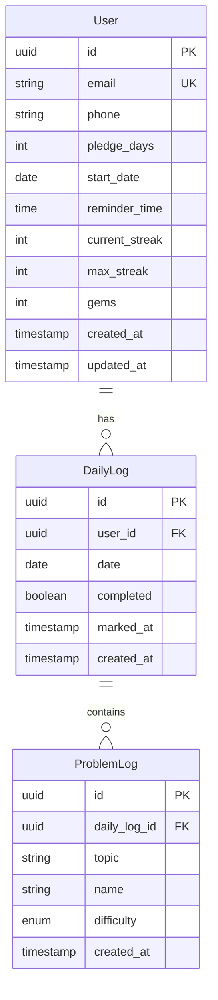
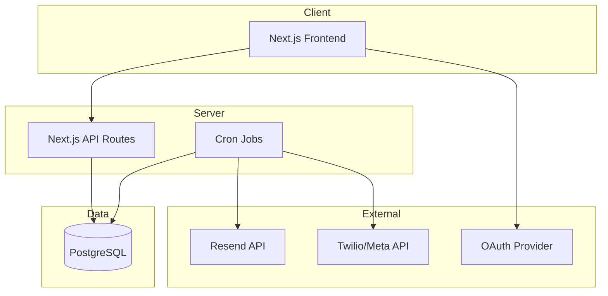

# Product Requirements Document: StreakDSA

**Document Version:** 1.0  
**Last Updated:** 2026-01-01  
**Status:** Draft

---

## Table of Contents

1. [Executive Summary](#1-executive-summary)
2. [Problem Statement](#2-problem-statement)
3. [Product Vision & Principles](#3-product-vision--principles)
4. [Target Audience](#4-target-audience)
5. [User Stories & User Flows](#5-user-stories--user-flows)
6. [Functional Requirements](#6-functional-requirements)
7. [Non-Functional Requirements](#7-non-functional-requirements)
8. [Data Model](#8-data-model)
9. [UI/UX Specifications](#9-uiux-specifications)
10. [Technical Architecture](#10-technical-architecture)
11. [Out of Scope](#11-out-of-scope)
12. [Success Metrics](#12-success-metrics)
13. [Project Timeline](#13-project-timeline)
14. [Future Considerations](#14-future-considerations)
15. [Integration Strategy](#15-integration-strategy)
16. [Appendix](#16-appendix)

---

## 1. Executive Summary

### 1.1 Product Overview

**StreakDSA** is a commitment enforcement system designed to make skipping daily DSA (Data Structures & Algorithms) practice psychologically harder than completing it.

| Attribute        | Value                                                         |
| ---------------- | ------------------------------------------------------------- |
| **Working Name** | StreakDSA                                                     |
| **Inspired By**  | Duolingo (streaks, gems), GitHub (heatmap)                    |
| **Target User**  | Solo developers and working professionals preparing DSA daily |
| **Primary Goal** | Enforce daily DSA execution through accountability mechanisms |

### 1.2 Core Value Proposition

> **This is not a productivity app. This is a commitment enforcement system.**

When a user skips:

- They lose their streak
- They see the failure
- They feel the consequence

---

## 2. Problem Statement

### 2.1 The Challenge

Most DSA preparation plans fail not due to lack of learning content, but due to:

| Failure Factor                       | Description                                          |
| ------------------------------------ | ---------------------------------------------------- |
| **No External Accountability**       | Self-commitment without consequences rarely persists |
| **No Immediate Consequences**        | Skipping a day has no visible impact                 |
| **No Visual Progress Reinforcement** | Achievements aren't celebrated or visualized         |
| **No Commitment Mechanism**          | Open-ended goals lack urgency                        |

### 2.2 Current State

Users attempting DSA preparation face:

- **Motivation decay** after initial enthusiasm
- **Silent failures** where missed days go unnoticed
- **No commitment contract** with defined end dates
- **Lack of visual shame** for broken commitments

### 2.3 Solution

**StreakDSA enforces daily execution through:**

```
Streaks + Reminders + Visual Shame + Rewards
```

---

## 3. Product Vision & Principles

### 3.1 Product Vision

A daily accountability system that makes breaking DSA commitments painful and visible, while rewarding consistency.

### 3.2 Core Principles (Non-Negotiable)

| Principle              | Description                                    |
| ---------------------- | ---------------------------------------------- |
| **One Action Per Day** | User marks DSA done — nothing else required    |
| **Zero Friction**      | Check-in must take ≤10 seconds                 |
| **Harsh Streak Loss**  | No silent failures; broken streaks are visible |
| **Visual Progress**    | Matrix heatmap shows history at a glance       |
| **Fixed Pledge**       | Commitment has a defined end date              |

---

## 4. Target Audience

### 4.1 Primary Persona

| Attribute      | Value                                          |
| -------------- | ---------------------------------------------- |
| **Profile**    | Solo developer / working professional          |
| **Goal**       | Preparing for DSA interviews or skill building |
| **Behavior**   | Wants daily accountability, not course content |
| **Pain Point** | Struggles with consistency, not knowledge      |

### 4.2 User Characteristics

- Self-motivated but needs external reinforcement
- Prefers simplicity over feature-rich solutions
- Values visual progress tracking
- Responds to commitment mechanisms (streaks, pledges)

---

## 5. User Stories & User Flows

### 5.1 User Stories

#### US-001: User Onboarding

> **As a** new user  
> **I want to** sign up and set my DSA pledge  
> **So that** I can start my accountability journey with a defined commitment

**Acceptance Criteria:**

- [ ] User can sign up via Magic Link or Google OAuth
- [ ] User sets pledge duration (e.g., 30, 60, 90 days)
- [ ] User sets daily reminder time
- [ ] User provides phone number for WhatsApp notifications (optional)

---

#### US-002: Daily Check-In

> **As a** pledged user  
> **I want to** mark my daily DSA practice as complete  
> **So that** my streak is maintained and I stay accountable

**Acceptance Criteria:**

- [ ] Single "Mark Today Complete" button visible on dashboard
- [ ] Check-in takes less than 10 seconds
- [ ] Day marked as completed immediately updates streak
- [ ] Deadline enforcement (default: 10:00 PM user's time)
- [ ] After deadline, day is marked as missed automatically

---

#### US-003: Problem Logging (Optional)

> **As a** user who completed daily practice  
> **I want to** optionally log the problems I solved  
> **So that** I can track what topics I've covered

**Acceptance Criteria:**

- [ ] Optional — can skip without affecting completion
- [ ] Maximum 2 problems per day
- [ ] Fields: Topic (dropdown), Problem name (text), Difficulty (Easy/Medium/Hard)

---

#### US-004: View Progress Heatmap

> **As a** user  
> **I want to** see my progress in a visual matrix  
> **So that** I can immediately understand my consistency patterns

**Acceptance Criteria:**

- [ ] GitHub-style heatmap view
- [ ] Rows represent topics
- [ ] Columns represent dates
- [ ] Color coding: 🟩 completed, 🟥 missed, 🔥 streak milestones

---

#### US-005: Receive Notifications

> **As a** user  
> **I want to** receive daily reminders and missed day alerts  
> **So that** I'm held accountable and don't silently fail

**Acceptance Criteria:**

- [ ] Daily reminder at user-configured time via WhatsApp + Email
- [ ] Missed day alert sent next morning
- [ ] Message includes current streak and days remaining

---

### 5.2 User Flow: Happy Path



---

## 6. Functional Requirements

### 6.1 Daily Check-In System

| ID     | Requirement                                                 | Priority |
| ------ | ----------------------------------------------------------- | -------- |
| FR-001 | System shall provide a single "Mark Today Complete" button  | P0       |
| FR-002 | Check-in deadline shall be configurable (default: 10:00 PM) | P0       |
| FR-003 | Missed deadline automatically marks day as incomplete       | P0       |
| FR-004 | No partial credit — completion is binary only               | P0       |

### 6.2 Streak System

| ID     | Requirement                                                      | Priority |
| ------ | ---------------------------------------------------------------- | -------- |
| FR-010 | System shall track `current_streak` (consecutive completed days) | P0       |
| FR-011 | System shall track `max_streak` (highest streak achieved)        | P0       |
| FR-012 | System shall track `pledge_days` (total commitment)              | P0       |
| FR-013 | System shall track `days_completed` (total successful days)      | P0       |
| FR-014 | Streak increments by 1 when day is marked complete               | P0       |
| FR-015 | Streak resets to 0 when day is missed                            | P0       |
| FR-016 | Pledge success is achieved when `days_completed == pledge_days`  | P0       |

### 6.3 Gems Economy

| Action                 | Gems Awarded |
| ---------------------- | ------------ |
| Day completed          | +10          |
| 7-day streak achieved  | +50          |
| 30-day streak achieved | +200         |
| Pledge completed       | +500         |

| ID     | Requirement                                          | Priority |
| ------ | ---------------------------------------------------- | -------- |
| FR-020 | System shall award gems based on actions table above | P1       |
| FR-021 | Gems are display-only — no spending mechanism        | P1       |
| FR-022 | Total gems visible on dashboard                      | P1       |

### 6.4 Problem Tracking

| ID     | Requirement                                                      | Priority |
| ------ | ---------------------------------------------------------------- | -------- |
| FR-030 | User can optionally log up to 2 problems per day                 | P2       |
| FR-031 | Problem fields: Topic (dropdown), Name (text), Difficulty (enum) | P2       |
| FR-032 | Difficulty options: Easy, Medium, Hard                           | P2       |
| FR-033 | Problem logging is independent of day completion                 | P2       |

### 6.5 Matrix Heatmap View

| ID     | Requirement                                               | Priority |
| ------ | --------------------------------------------------------- | -------- |
| FR-040 | System shall display a matrix-style heatmap               | P0       |
| FR-041 | Rows represent topics                                     | P0       |
| FR-042 | Columns represent dates                                   | P0       |
| FR-043 | Cell states: 🟩 completed, 🟥 missed, 🔥 streak milestone | P0       |
| FR-044 | Heatmap is scrollable for date navigation                 | P1       |

### 6.6 Notifications

| ID     | Requirement                                                              | Priority |
| ------ | ------------------------------------------------------------------------ | -------- |
| FR-050 | Daily reminder sent at user-configured time                              | P0       |
| FR-051 | Reminder sent via WhatsApp AND Email                                     | P0       |
| FR-052 | Reminder message format: "Day X/Y. Streak at risk. Mark today complete." | P0       |
| FR-053 | Missed day alert sent next morning                                       | P0       |
| FR-054 | Missed alert format: "You broke your streak at X days."                  | P0       |

---

## 7. Non-Functional Requirements

### 7.1 Performance

| ID      | Requirement          | Target      |
| ------- | -------------------- | ----------- |
| NFR-001 | Dashboard load time  | < 2 seconds |
| NFR-002 | Check-in action time | < 500ms     |
| NFR-003 | Heatmap render time  | < 1 second  |

### 7.2 Availability

| ID      | Requirement           | Target                                 |
| ------- | --------------------- | -------------------------------------- |
| NFR-010 | System uptime         | 99.5%                                  |
| NFR-011 | Notification delivery | 99% within 5 minutes of scheduled time |

### 7.3 Usability

| ID      | Requirement              | Target                                |
| ------- | ------------------------ | ------------------------------------- |
| NFR-020 | Check-in flow completion | ≤ 10 seconds from open to complete    |
| NFR-021 | Mobile responsiveness    | Full functionality on mobile browsers |

### 7.4 Security

| ID      | Requirement        | Target                               |
| ------- | ------------------ | ------------------------------------ |
| NFR-030 | Authentication     | Magic Link or OAuth 2.0 (Google)     |
| NFR-031 | Data encryption    | TLS 1.3 for transit, AES-256 at rest |
| NFR-032 | Session management | Secure, HTTP-only cookies            |

---

## 8. Data Model

### 8.1 Entity Relationship Diagram



### 8.2 Schema Details

#### User Table

| Field          | Type         | Constraints               | Description              |
| -------------- | ------------ | ------------------------- | ------------------------ |
| id             | UUID         | PK                        | Unique identifier        |
| email          | VARCHAR(255) | UK, NOT NULL              | User email               |
| phone          | VARCHAR(20)  | NULLABLE                  | WhatsApp number          |
| pledge_days    | INT          | NOT NULL                  | Total commitment days    |
| start_date     | DATE         | NOT NULL                  | Pledge start date        |
| reminder_time  | TIME         | NOT NULL, DEFAULT '22:00' | Daily reminder time      |
| current_streak | INT          | DEFAULT 0                 | Current consecutive days |
| max_streak     | INT          | DEFAULT 0                 | Highest streak achieved  |
| gems           | INT          | DEFAULT 0                 | Total gems earned        |
| created_at     | TIMESTAMP    | NOT NULL                  | Account creation         |
| updated_at     | TIMESTAMP    | NOT NULL                  | Last update              |

#### DailyLog Table

| Field      | Type      | Constraints             | Description          |
| ---------- | --------- | ----------------------- | -------------------- |
| id         | UUID      | PK                      | Unique identifier    |
| user_id    | UUID      | FK → User.id            | Owner reference      |
| date       | DATE      | NOT NULL                | Log date             |
| completed  | BOOLEAN   | NOT NULL, DEFAULT FALSE | Completion status    |
| marked_at  | TIMESTAMP | NULLABLE                | When marked complete |
| created_at | TIMESTAMP | NOT NULL                | Record creation      |

**Constraints:**

- UNIQUE(user_id, date) — one log per user per day

#### ProblemLog Table

| Field        | Type         | Constraints      | Description            |
| ------------ | ------------ | ---------------- | ---------------------- |
| id           | UUID         | PK               | Unique identifier      |
| daily_log_id | UUID         | FK → DailyLog.id | Parent log reference   |
| topic        | VARCHAR(100) | NOT NULL         | Problem topic/category |
| name         | VARCHAR(255) | NOT NULL         | Problem name           |
| difficulty   | ENUM         | NOT NULL         | Easy, Medium, Hard     |
| created_at   | TIMESTAMP    | NOT NULL         | Record creation        |

**Constraints:**

- Maximum 2 problems per daily_log_id (enforced at application level)

---

## 9. UI/UX Specifications

### 9.1 Screens Overview

| Screen      | Purpose                                      | Priority |
| ----------- | -------------------------------------------- | -------- |
| Dashboard   | Primary interaction — streak, gems, check-in | P0       |
| Today Log   | Optional problem logging                     | P2       |
| Matrix View | Visual progress heatmap                      | P0       |
| Onboarding  | Pledge setup                                 | P0       |

### 9.2 Dashboard Screen

**Components:**

```
┌─────────────────────────────────────────────┐
│                                             │
│     🔥 Current Streak: 16 days              │
│     💎 Gems: 210                            │
│     ⏳ Days Remaining: 74/90                │
│                                             │
│  ╔═════════════════════════════════════╗   │
│  ║                                     ║   │
│  ║    [ Mark Today Complete ✓ ]        ║   │
│  ║                                     ║   │
│  ╚═════════════════════════════════════╝   │
│                                             │
│     Optional: Log problems solved today     │
│                                             │
└─────────────────────────────────────────────┘
```

**States:**

- **Pending:** Button active, awaiting check-in
- **Completed:** Button disabled, shows checkmark
- **Missed:** Shows ❌ with streak reset message

### 9.3 Today Log Screen

**Fields:**

- Topic (Dropdown): Arrays, Strings, Trees, Graphs, DP, etc.
- Problem Name (Text input)
- Difficulty (Radio): Easy | Medium | Hard
- Save Button

**Constraints:**

- Maximum 2 problems displayed
- Add button disabled after 2 entries

### 9.4 Matrix View Screen

**Layout:**

- Horizontal scroll for date navigation
- Vertical scroll for topic navigation
- Cell size: touch-friendly (minimum 40x40px)
- Legend: 🟩 Completed | 🟥 Missed | 🔥 Milestone

---

## 10. Technical Architecture

### 10.1 Tech Stack

| Layer              | Technology                | Rationale                                      |
| ------------------ | ------------------------- | ---------------------------------------------- |
| **Frontend**       | Next.js                   | SSR, fast builds, integrated routing           |
| **Backend**        | Next.js API Routes        | Unified codebase, serverless-ready             |
| **Database**       | PostgreSQL                | Reliable, ACID-compliant, good for time-series |
| **ORM**            | Prisma                    | Type-safe, migrations, developer experience    |
| **Authentication** | Magic Link / Google OAuth | Low friction, no password management           |
| **Email**          | Resend                    | Developer-friendly API, reliability            |
| **WhatsApp**       | Twilio / Meta API         | Enterprise-grade delivery                      |
| **Scheduler**      | Cron (Vercel / Railway)   | Native platform support                        |
| **Hosting**        | Vercel / Railway          | Easy deployment, edge functions                |

### 10.2 System Architecture



### 10.3 Cron Jobs

| Job                  | Schedule                   | Description                             |
| -------------------- | -------------------------- | --------------------------------------- |
| Send Daily Reminders | Once/day per user timezone | Send reminder at user's configured time |
| Check Missed Days    | Daily at midnight          | Mark uncompleted days as missed         |
| Update Streaks       | After missed day check     | Reset streaks for users who missed      |
| Award Gems           | After streak updates       | Award milestone gems                    |

### 10.4 API Endpoints

| Endpoint                  | Method | Description             |
| ------------------------- | ------ | ----------------------- |
| `/api/auth/[...nextauth]` | \*     | Authentication handlers |
| `/api/user/onboard`       | POST   | Set pledge and reminder |
| `/api/checkin`            | POST   | Mark today complete     |
| `/api/problems`           | POST   | Log a problem           |
| `/api/dashboard`          | GET    | Get dashboard data      |
| `/api/matrix`             | GET    | Get heatmap data        |
| `/api/cron/reminder`      | POST   | Trigger daily reminders |
| `/api/cron/process-day`   | POST   | Process missed days     |

---

## 11. Out of Scope

The following features are **explicitly NOT included** in MVP:

| Feature                 | Reason                                |
| ----------------------- | ------------------------------------- |
| ❌ Social features      | This is personal accountability       |
| ❌ Leaderboards         | Competition not part of core value    |
| ❌ Discussion/comments  | Not a community platform              |
| ❌ Analytics dashboards | Heatmap is sufficient                 |
| ❌ Motivational quotes  | Not an inspiration app                |
| ❌ Courses/content      | This is accountability, not education |
| ❌ AI suggestions       | Keeping it simple                     |
| ❌ Gem spending/store   | Display-only economy                  |

---

## 12. Success Metrics

### 12.1 Primary Metrics (Binary)

| Metric                 | Target                              | Method                                |
| ---------------------- | ----------------------------------- | ------------------------------------- |
| Pledge Completion Rate | User completes ≥80% of pledged days | `days_completed / pledge_days >= 0.8` |
| Streak Consistency     | Never skip >2 consecutive days      | Monitor max gap in DailyLog           |
| Visual Fill Rate       | Heatmap visibly fills over time     | UI observation                        |

### 12.2 Secondary Metrics

| Metric                 | Target                |
| ---------------------- | --------------------- |
| Daily Active Users     | 80% of active pledges |
| Check-in Time          | < 10 seconds          |
| Notification Open Rate | > 30%                 |

> **If primary metrics are achieved → Product works.**

---

## 13. Project Timeline

### 13.1 Development Schedule (7 Days)

| Day       | Task                     | Deliverable                       |
| --------- | ------------------------ | --------------------------------- |
| **Day 1** | Auth + User model        | Working signup/login, User schema |
| **Day 2** | Daily log + streak logic | Check-in API, streak calculation  |
| **Day 3** | Dashboard + check-in     | Dashboard UI, check-in button     |
| **Day 4** | Matrix view              | Heatmap component                 |
| **Day 5** | Email reminders          | Resend integration, cron job      |
| **Day 6** | WhatsApp integration     | Twilio/Meta setup                 |
| **Day 7** | Polish + deploy          | Testing, production deployment    |

### 13.2 Milestones

| Milestone             | Target Date | Criteria                      |
| --------------------- | ----------- | ----------------------------- |
| M1: Auth Complete     | Day 1 EOD   | User can sign up and log in   |
| M2: Core Loop Working | Day 3 EOD   | User can check in, see streak |
| M3: Visualization     | Day 4 EOD   | Heatmap displays correctly    |
| M4: Notifications     | Day 6 EOD   | Reminders sending correctly   |
| M5: Production Ready  | Day 7 EOD   | Deployed, tested, monitored   |

---

## 14. Future Considerations

The following are **out of scope for MVP** but may be considered for future versions:

| Feature            | Description                           | Version |
| ------------------ | ------------------------------------- | ------- |
| Forgiveness Tokens | Allow 1-2 recovery tokens per pledge  | v2.0    |
| Multiple Pledges   | Run sequential or parallel pledges    | v2.0    |
| Mobile App         | Native iOS/Android applications       | v3.0    |
| Team Mode          | Group accountability (optional)       | v3.0    |
| Topic Analytics    | Detailed breakdowns by topic          | v2.0    |
| LeetCode Sync      | Auto-detect completed problems        | v2.0    |
| DSA Sheet Import   | Import progress from Striver/NeetCode | v2.0    |

---

## 15. Integration Strategy

### 15.1 MVP Approach: Manual Check-In

> [!IMPORTANT] > **MVP uses manual check-in only.** No external integrations.

**Rationale:**

- Zero external dependencies — won't break if LeetCode changes
- Works for any source — LeetCode, Codeforces, NeetCode, AlgoExpert, custom problems
- Faster to ship within 7-day timeline
- Core value is accountability, not tracking

**User Flow:**

1. User solves problems anywhere (LeetCode, Striver sheet, etc.)
2. User opens StreakDSA
3. User clicks "Mark Today Complete"
4. Optionally logs 1-2 problems solved

### 15.2 Post-MVP: LeetCode Integration (v2.0)

**Priority:** Nice-to-have

**Options:**
| Approach | Pros | Cons |
|----------|------|------|
| Browser Extension | Direct detection, reliable | Requires install, more work |
| GraphQL Scraping | No install needed | Unofficial, may break |
| User-submitted link | Simple, reliable | Still manual |

**Recommended:** Browser extension that auto-populates problem log when user solves on LeetCode.

### 15.3 Post-MVP: DSA Sheet Import (v2.0)

**Target Sheets:**

- [Striver's A2Z DSA Sheet](https://takeuforward.org/dsa/strivers-a2z-sheet-learn-dsa-a-to-z)
- NeetCode 150/75
- Blind 75

**Striver A2Z Structure (455 problems):**

| Step | Topic                        | Problems |
| ---- | ---------------------------- | -------- |
| 1    | Learn the Basics             | 31       |
| 2    | Sorting Techniques           | 7        |
| 3    | Arrays (Easy → Hard)         | 40       |
| 4    | Binary Search                | 32       |
| 5    | Strings                      | 15       |
| 6    | Linked Lists                 | 31       |
| 7    | Recursion                    | 25       |
| 8    | Bit Manipulation             | 18       |
| 9    | Stack & Queues               | 30       |
| 10   | Sliding Window & Two Pointer | 12       |
| 11   | Heaps                        | 17       |
| 12   | Greedy                       | 16       |
| 13   | Binary Trees                 | 39       |
| 14   | Binary Search Trees          | 16       |
| 15   | Graphs                       | 54       |
| 16   | Dynamic Programming          | 56       |
| 17   | Tries                        | 7        |
| 18   | Advanced Strings             | 9        |

**Import Feature Design:**

- User selects which sheet they're following
- Topics auto-populated from sheet structure
- Progress can be synced via sheet URL (if public) or manual mapping

### 15.4 Integration Decision Matrix

| Feature                    | MVP | v2.0 | v3.0 |
| -------------------------- | --- | ---- | ---- |
| Manual check-in            | ✅  | ✅   | ✅   |
| Manual problem logging     | ✅  | ✅   | ✅   |
| LeetCode browser extension | ❌  | ✅   | ✅   |
| Striver sheet import       | ❌  | ✅   | ✅   |
| LeetCode GraphQL sync      | ❌  | ❌   | ⚠️   |
| Codeforces integration     | ❌  | ❌   | ⚠️   |

**Legend:** ✅ Included | ❌ Not included | ⚠️ Evaluate feasibility

---

## 16. Appendix

### 16.1 Notification Templates

#### Daily Reminder

```
WhatsApp/Email:
"Day {current_day}/{pledge_days}. Streak at risk. Mark today complete."

Example:
"Day 17/90. Streak at risk. Mark today complete."
```

#### Missed Day Alert

```
WhatsApp/Email:
"You broke your streak at {streak_days} days."

Example:
"You broke your streak at 16 days."
```

### 16.2 Topic Dropdown Options (Aligned with Striver A2Z)

```
- Basics & Fundamentals
- Sorting Techniques
- Arrays
- Binary Search
- Strings
- Linked Lists
- Recursion & Backtracking
- Bit Manipulation
- Stacks & Queues
- Sliding Window & Two Pointer
- Heaps
- Greedy
- Binary Trees
- Binary Search Trees
- Graphs
- Dynamic Programming
- Tries
- Other
```

### 16.3 Difficulty Enum

```typescript
enum Difficulty {
  EASY = "Easy",
  MEDIUM = "Medium",
  HARD = "Hard",
}
```

---

## Document History

| Version | Date       | Author | Changes              |
| ------- | ---------- | ------ | -------------------- |
| 1.0     | 2026-01-01 | —      | Initial PRD creation |

---

**End of Document**
